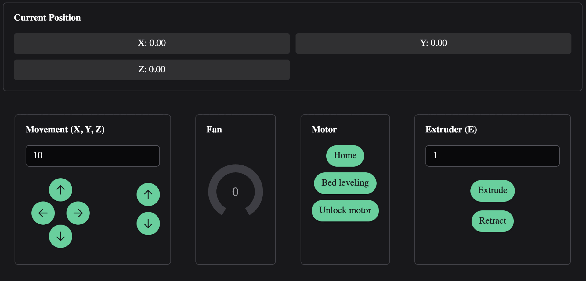

# Xcontroller-App


Desktop/Web application to communicate with [XController](https://github.com/J040M/xcontroller)

## Demo



## Features

- [x] **Movement Control**: Precisely control the movement of your printer's axes directly from the interface.
- [x] **3D position viewer**: Visualize toll movement in 3D space
- [x] **Temperature Graphs**: Monitor and analyze temperature changes of the printer's components in real-time.
- [x] **Terminal**: Send commands to the printer and view live responses via a dedicated terminal.
- [x] **File Listing**: Browse and manage files stored on your 3D printer.
- [x] **Run print jobs**: Run 3D printing job from SD card.
- [x] **Printer Status**: Get live updates on the printer's status, including print progress, and more.
- [x] **GCode Viewer**: Visualize your 3D printing jobs with an integrated GCode viewer.
- [ ] **Upload files to SD**: Upload files to SD card.

## Development

Run the app locally on browser
```npm install && npm run dev```

## Build from source

Build Vue app (webapp)
```npm run build```
Build Tauri app (native app)
```npm run tauri build```

For more information regarding build check [Tauri](https://v2.tauri.app/distribute/)
