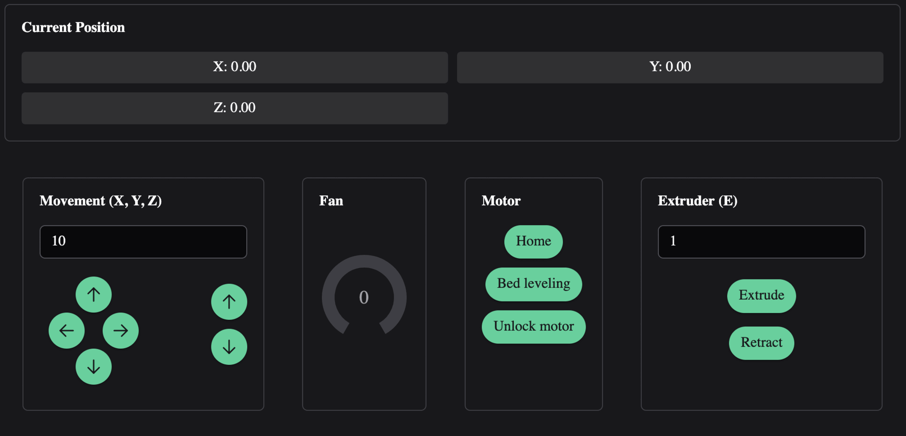

# Xcontroller-App


Desktop/Web application to communicate with [XController](https://github.com/J040M/xcontroller)

## Features

- [x] **Movement Control**: Precisely control the movement of your printer's axes directly from the interface.
- [x] **3D position viewer**: Visualize toll movement in 3D space
- [x] **Temperature Graphs**: Monitor and analyze temperature changes of the printer's components in real-time.
- [x] **Terminal**: Send commands to the printer and view live responses via a dedicated terminal.
- [x] **File Listing**: Browse and manage files stored on your 3D printer.
- [x] **Run print jobs**: Run 3D printing job from SD card.
- [x] **Printer Status**: Get live updates on the printer's status, including print progress, and more.
- [x] **GCode Viewer**: Visualize your 3D printing jobs with an integrated GCode viewer.
- [x] **Upload files to SD**: Stream G-code files to the printer's SD card over the binary upload protocol.
- [x] **USB or network**: Connect over the network (WebSocket) or, in the native app, directly over USB serial.

## Development

Run the app locally on browser
```npm install && npm run dev```

## Build from source

Build Vue app (webapp)
```npm run build```
Build Tauri app (native app)
```npm run tauri build```

The web and native builds are independent. CI builds the web bundle on the
`releases` branch (`.github/workflows/build-web-and-release.yml`) and drafts
native installers for macOS (universal), Linux (x86_64 + aarch64) and Windows
(x86_64 + aarch64) on the `native-releases` branch
(`.github/workflows/build-native-and-release.yml`). Native artifacts are
currently unsigned.

Building the native shell on Linux needs the Tauri v2 system dependencies plus
`libudev-dev` for serial port access:
```sudo apt-get install libwebkit2gtk-4.1-dev build-essential curl wget file libxdo-dev libssl-dev libayatana-appindicator3-dev librsvg2-dev libudev-dev```

## Connecting to a printer

Each printer profile picks a connection type:

- **WebSocket (network)** — available in both the web and native app. Point it
  at a running [XController](https://github.com/J040M/xcontroller) backend
  (`ws://host:port`), with an optional auth token.
- **USB (serial)** — native app only. Select the printer's serial port and baud
  rate; the app talks Marlin G-code directly over the port. The web build hides
  this option.

USB serial, per OS:

- **macOS** — ports appear as `/dev/cu.usbserial-*` / `/dev/cu.usbmodem*`; no extra setup.
- **Linux** — your user must be in the `dialout` group to open `/dev/ttyUSB*` /
  `/dev/ttyACM*`. If a connection fails with a permission error, run
  `sudo usermod -aG dialout $USER` and log back in.
- **Windows** — ports appear as `COM*`; no extra setup.

## Demo




For more information regarding build check [Tauri](https://v2.tauri.app/distribute/)
